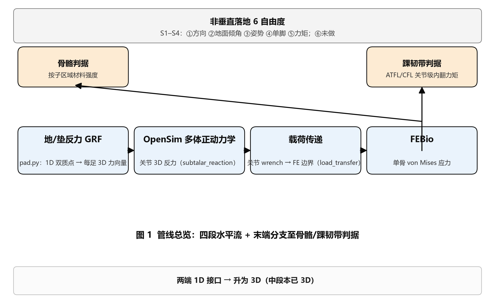
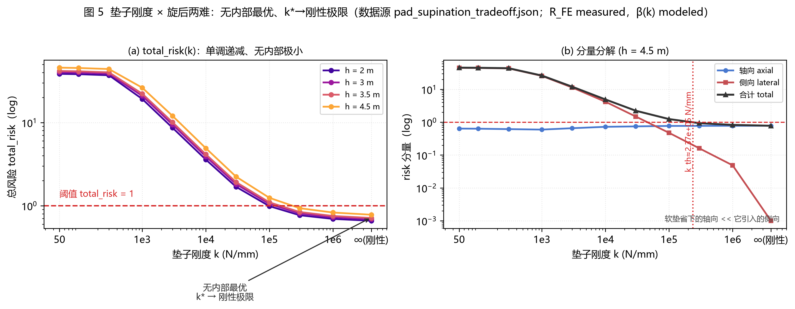
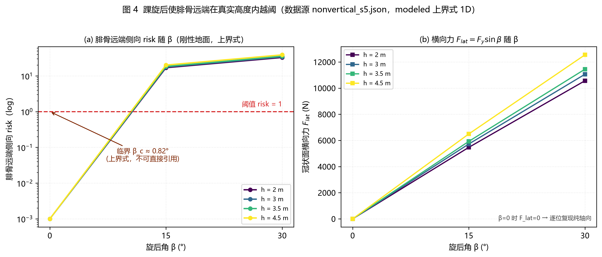
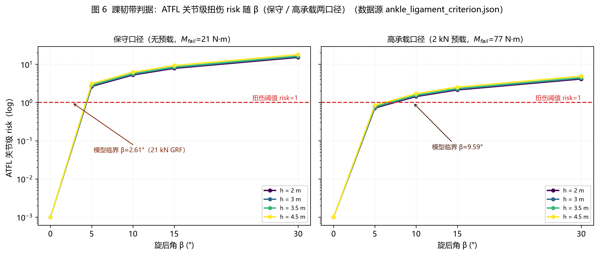
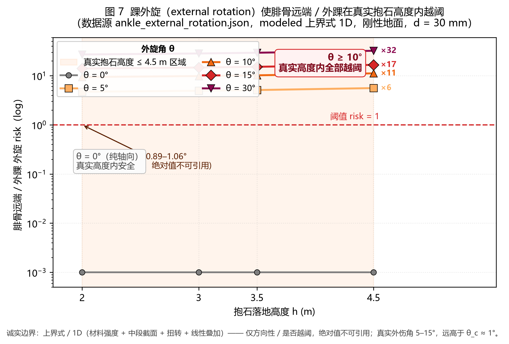
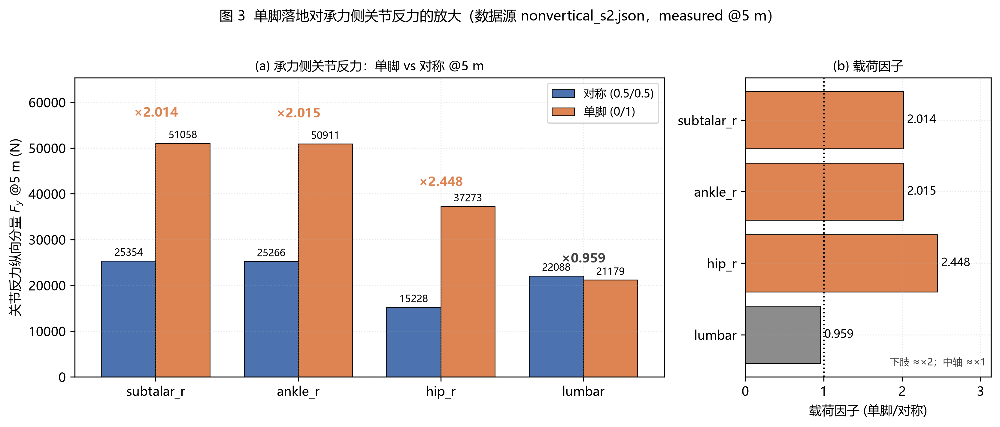
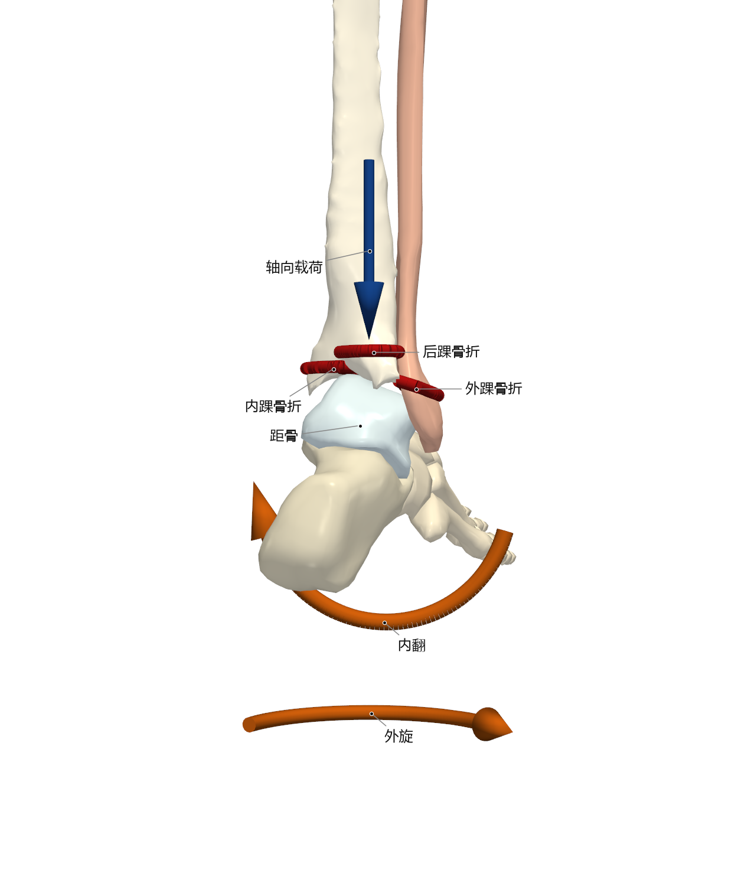
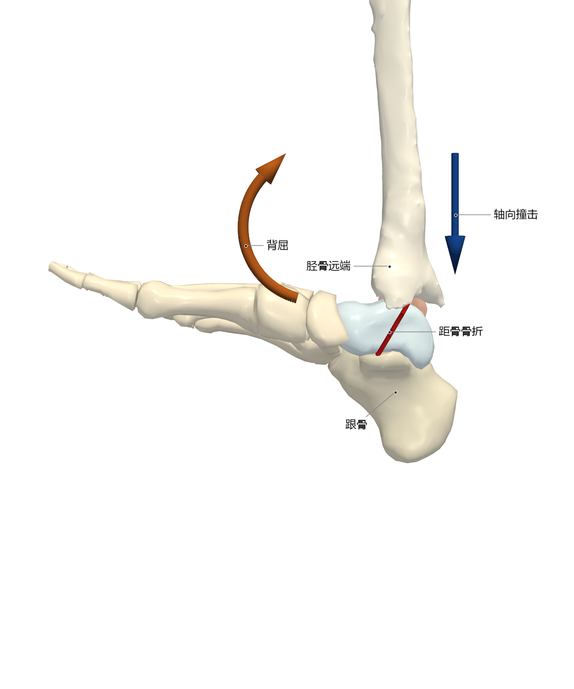

# 软垫上为何仍会骨折？——室内抱石落地骨与韧带损伤的数值建模

> **初稿 v2（2026-10-05）** · 中文 · 方法 + 应用论文
> 基于 `docs/汇总报告_骨与韧带损伤建模.md` 及 `results/opensim_fe/` 各详细报告。
> **口径声明**：本文所有结果均为**相对 / 定性**对照；**绝对骨折高度不可移植**（单骨模型 vs 全身）。凡"上界式 / 建模 / 假设"处均在文中标注。
> **v2 改动**：全文改为**问题驱动**主线——围绕"软垫为何未能阻止骨折（尤其三踝、距骨）"组织；新增外旋（三踝外踝臂）建模 [§3.4]、三踝/距骨机制 [§3.6]、危险情形与预防 [§3.7/§4.3]。

---

## 摘要

**问题**：室内抱石坠落以下肢损伤为主、**踝关节居首位**（踝伤中约 71% 为韧带扭伤），但**骨折**——尤其是**三踝骨折、距骨骨折**——才是最具破坏性的结局。抱石场地普遍铺设厚软垫，软垫的设计目标是**吸收轴向压缩能量**。那么一个看似矛盾的问题随之而来：**为什么摔在软垫上仍会受伤，甚至骨折，乃至三踝、距骨骨折？哪种情形最容易受伤？应当如何避免？**

**方法**：本文把文献 [1] 的"直立双足坠地跨高度骨骼损伤有限元方法"迁移到**室内抱石软垫落地（≤4.5 m）**，构建"地/垫反力（GRF）→ OpenSim 多体正动力学（关节 3D 反力）→ 载荷传递（关节 wrench → 有限元边界）→ FEBio 单骨应力 / 韧带判据"四段式管线，并以**骨 + 韧带双判据**覆盖踝部两类主要损伤。为回答上述问题，逐批打通**轴向、旋转、姿态**三类落地自由度（垫刚度、内翻/旋后、外旋、单脚、姿势、3D 力矩），并保持轴向情形的逐位回归。

**结果**：(1) **基线——软垫对"压"确实有效**：纯轴向口径下首次骨折高度为**腓骨 7 m / 足部 8 m / 胫骨 8 m / 股骨 19 m**，7 m 临界高度与 [1] 一致；真实抱石高度（≤4.5 m）内下肢**不折**。(2) **盲区①（垫刚度两难）**：更软的垫子降低轴向骨折风险（首折 8→11 m，峰值 −23.6%），却因脚沉入增大踝旋后角，**显著提高旋转失效风险**——软垫护"压"、伤"扭"。(3) **盲区②（旋后 / 内翻）**：叠加旋后 15–30° 后，**腓骨远端（外踝）在 2–4.5 m 内即越阈**；内翻角 ≥10° 时 **ATFL 韧带**在两种预载口径下均判扭伤，覆盖临床第一位的踝扭伤。(4) **盲区③（外旋 / SER）**：叠加外旋 ≥10° 后，同一条腓骨的外踝臂在 2–4.5 m 全部越阈——**这正是三踝骨折（外踝臂）的支配机制**。(5) **盲区④（落地姿态）**：**单脚落地**使承力侧关节反力**翻倍**（距下 ×2.01、踝 ×2.02、髋 ×2.45），首次骨折高度**减半**。(6) **机制**：综合上述结果与文献，**三踝骨折**由"外旋 → 距骨楔入 → 外踝斜折 → 后踝撕脱 → 内踝/三角韧带"链式发生；**距骨骨折**由"背屈 + 轴向撞击"发生，且**距骨居于胫–距–跟载荷柱的唯一悬臂位**，软垫**无法改变足姿与载荷路径**，故不能屏蔽。

**结论**：软垫解决的是**轴向吸能**，而抱石踝部严重损伤（三踝、距骨）的主线是**旋转 / 剪切 + 关节几何楔入**——这是软垫的**结构性盲区**。**"有软垫" ≠ "安全"**；受伤与否主要由**落地瞬间的踝关节姿态（旋后 / 外旋 / 背屈）与单/双脚落地**决定。最危险情形依次为：**单脚先落 ≫ 外旋/旋后 ≫ 直立双足 ≫ 软垫**。规避方向是**双脚、屈腿、控制踝内外旋的"安全落地技术"**与**兼顾防沉入与吸能的分层/多密度垫**。

**关键词**：抱石；坠落；三踝骨折；距骨骨折；踝扭伤；有限元；多体动力学；非垂直落地

---

## 1 引言

### 1.1 现象：抱石热与"下落即伤"

近十余年攀岩（尤其抱石）参与人数迅速增长，相关损伤同步上升。在德国某一级创伤中心的统计中，抱石相关损伤由 2010 年的 3 例增至 2018 年的 71 例 [2,3]。与其它攀岩细分不同，抱石不使用绳索与安全带，坠落**直接落于地面/软垫**，因此急性损伤**以下肢为主**：一项纳入 430 例急诊患者的研究显示，下肢损伤占 **61.1%**，其中**踝关节占 36.7%**（受伤类型以**扭伤 71.3%**、**骨折 27.4%** 为主），其次为膝 16.8%、肘 12.3%、脊柱 7.2% [2,3]。尽管韧带扭伤在数量上占多数，**骨折——尤其三踝骨折、距骨骨折——才是致残、需手术、影响长期攀登生涯的严重结局**。

### 1.2 悖论：为"吸能"而设的软垫，为何仍挡不住骨折？

抱石场馆几乎都铺设厚软垫（crash pad），其工程目标是**在有限行程内吸收坠落动能、削低峰值冲击力**——本质上是**轴向（竖直）缓冲**。一项对 245 名抱石者的研究显示，**94% 的受伤者确实落在软垫上** [4]。于是产生一个反直觉的悖论：**既然软垫大幅削减了竖向冲击，为什么摔在上面仍会骨折，而且会是三踝、距骨这类"高能量"印象的骨折？**

这一悖论的关键线索来自落地**姿态**：同一研究指出，**85% 为非自主坠落，62% 由直立姿态起始，62% 在坠落中发生旋转，74% 为足先落地** [4]；法医坠落伤研究亦表明，**足先落地**是低空坠落（含抱石高度）的典型姿态、冲击经下肢传导 [8,9]；并描述了抱石踝伤的核心机制——**脚先沉入软垫、伴随踝关节旋后（内翻），当达到垫子的弹性模量后，作用在旋后关节上的力上升，直至韧带或骨骼失效** [3,4]。物理上，软垫只能吸收**轴向**能量，**不能约束**落地瞬间踝关节的**旋转（内翻 / 外旋 / 背屈）**——而旋转，恰恰是踝部严重骨折的主导机制（见 §1.3、§3.6）。

### 1.3 已有研究与盲区

**（a）全身坠落模型——以高度为主导。** 文献 [1]（《成人直立位双足坠地跨高度骨骼损伤机制的有限元分析》）建立了该领域的代表性数值方法：基于 THUMS AM50 全身模型的 LS-DYNA 仿真，模拟 1–50 m 双足落地，输出 9 个部位的 von Mises 应力，以 Logistic 回归与层次聚类刻画"阶跃 / 渐进"两类损伤模式与"5 群集 / 3 阶段"高度演化。但 [1] 的设定（直立对称双足、刚性地面、纯高度变量、仅骨骼）**与抱石软垫落地存在系统性差异**：抱石高度 ≤4.5 m、落于软垫、常见**单脚先落 / 斜向 / 带旋转**，且临床首位损伤是**软组织（韧带）**。

**（b）临床与机制研究——指向"旋转"。** 美国 NEISS 数据显示攀岩相关损伤约 60% 源于坠落、踝为最常受伤部位之一 [6]；一项纳入 507 名室内抱石者的前瞻研究显示下肢损伤更常由坠落/跳落引起且更严重 [5]；基于 THUMS 的踝损伤研究进一步指出，坠落/冲击下踝损伤与**落地姿态**密切相关 [17]。而在**关节机制**层面，骨科与生物力学文献早已确立：

- **三踝骨折**的主流机制是 **Lauge-Hansen 旋后–外旋（SER）**——**外旋**为支配因素，占踝骨折 57–85% [22,23]。经典尸体实验 **Hirsch & Lewis** 证明：**踝可承受很大的竖直压缩**（失败发生在胫骨近端或跟骨），但**很小的旋转力矩即可使踝失效** [24]；现代 PMHS 冲击实验 **Funk 等** 亦发现，即便在名义轴向冲击下产生的踝骨折，其踝旋转**都在 10° 以内**——即**外踝对微小旋转极其敏感** [25]。
- **距骨骨折**的经典机制是 **Hawkins 所述的"背屈 + 轴向撞击"**：足背屈时距骨颈被楔入胫骨穹前缘，在**胫–距–跟载荷柱**中作为**唯一结构悬臂**而失效 [28,29,30]；其 50% 骨折概率对应的轴向载荷仅约 **6–10 kN** [14,25,31]——**远低于日常认知的"高能量"**。

**（c）盲区。** 上述三条线索共同表明：**软垫（轴向缓冲）与踝部骨折（旋转主导）之间存在机制错配**，而现有抱石文献多为流行病学描述，缺乏对**"软垫落地为何仍停不住旋转致伤"**的定量刻画。[4] 亦在结论中明确呼吁：**用有限元数值建模重建完整跌倒场景，以理解损伤机制并评估不同软垫设计对损伤结果的影响**。本文即回应这一呼吁。

### 1.4 本文三问与贡献

围绕上述悖论，本文提出并回答三个问题：

- **Q1 为什么软垫仍未能阻止骨折？**——识别软垫的**结构性盲区**（轴向吸能 vs 旋转失稳）。
- **Q2 什么情况最容易受伤？**——给出**危险情形排序**（单脚 / 外旋 / 旋后 / 直立双足 / 软垫）。
- **Q3 如何避免？**——给出**落地技术与垫子设计**的相对定量依据。

方法上，本文构建一条"多体动力学 + 有限元"的**可复现管线**，把 [1] 的骨骼损伤方法迁移到抱石落地，并作出以下贡献：

1. **方法迁移与对齐**：以"纯轴向 + 子区域强度"判据**复现 [1] 的 7 m 临界高度**，并**如实界定**单骨模型无法复现的边界；
2. **骨–韧带双判据**：在骨骨折判据外补齐**踝外侧韧带扭伤判据**，覆盖临床第一位的踝扭伤（约占踝伤 71%）；
3. **三类场景自由度**：系统打通**轴向、旋转、姿态**三类落地自由度，并保证轴向情形逐位回归；
4. **回答悖论**：把散落的结果收敛为一条因果链——**软垫吸"压"失"旋" → 旋转把外踝/距骨推入真实高度内的失效区**，并给出**三踝的"外踝臂"**与**距骨**两条机制的定量/文献证据。

---

## 2 方法

### 2.1 总体思路

本文方法由四段构成（图 1）：

```
地/垫反力 GRF(pad) → OpenSim 多体正动力学(关节 3D 反力)
                    → 载荷传递(关节 wrench → 有限元边界)
                    → FEBio 单骨应力 / 韧带判据
```



**架构前提**：OpenSim 为多刚体，无法直接输出 von Mises 应力；因此显式拆分为"多体出动载荷 + 单骨有限元出应力"。管线中段（关节反力）天然为三维，本文的扩展集中于把**两端的接口升级为"轴向 + 旋转 + 姿态"三类可调维度**并保持物理一致。

### 2.2 载荷链

- **地面/垫反力**：采用 1D 双质点软垫接触模型（由落高与接触刚度给出峰值 GRF 与时程），并推广为**每足 3D 力向量**（含水平分量与地面法向）。
- **OpenSim 正动力学**：以 AM50 全身模型（Rajagopal 等 [20]）进行坠落仿真；足部施加载荷时程，解出各关节（距下、踝、膝、髋、脊柱）的**三维反力与力矩**（牛顿自由体，验证残差 ~1e−12）。
- **载荷传递**：把关节三维 wrench 映射为有限元边界（力 + 力矩）。
- **有限元**：对代表骨（跟骨、胫骨、腓骨、股骨、骨盆、L3/T6/C5、颅骨）建立单骨 FE 模型，采用双材料（松质 + 皮质壳），以 FEBio [21] 求解 von Mises 应力。

### 2.3 骨骼判据

骨骼判据采用 [1] 的**按子区域材料强度**（压缩，MPa），见**表 1**。

**表 1** 骨骼判据的子区域材料强度（源自 [1] 表 1）

| 部位 | 强度 | 部位 | 强度 |
|---|---:|---|---:|
| 跟骨 | 150 | 股骨**颈** | 80 |
| 胫骨**两端** | 70 | 股骨骨干 | 220 |
| 胫骨骨干 | 200 | 骨盆 | 180 |
| 腓骨**两端** | 70 | 脊柱 | 150 |
| 腓骨骨干 | 160 | 颅骨 | 160 |

**关键**：骨折点应按**实际失效部位**选取强度（两端 70 / 骨颈 80），而非骨干强度——本工作最初误用骨干强度，导致高度严重错配，修正后 7 m 阈值立即复现（见 §3.1）。

### 2.4 踝韧带判据

踝外侧韧带以 **ATFL（前距腓韧带）** 为主、CFL 次之。判据基于关节级内翻力矩：

```
M_inv = F_lat · d      （F_lat = F_vert·sinβ；β = 旋后/内翻角；d = CoP→距下轴力臂）
扭伤 ⟺ M_inv ≥ M_fail(预载)
```

失效阈值取自尸体文献（Funk 等 [13,14]）：**ATFL 首次失效内翻力矩 ≈21–34 N·m（无预载）**，2 kN 预载下升至 **≈77 N·m**；对应内翻角 **33–40°**。作为辅助口径，亦给出力/应变判据（ATFL 极限载荷 ≈200 N、失效应变 ≈14%，Siegler 等 [11,12]；Bahr 等 [15]；Rochelle 等 [16]）。生理参照带取自 [10]（尸体踝步态应变）：正常步态 ATFL 应变 ≤6.2%，"taut" 阈值 1%，韧带为**次级约束、仅在极端位置绷紧**。

### 2.5 三类场景旋钮（轴向 / 旋转 / 姿态）

为回答"什么情况容易受伤"，本文把落地自由度归为**三类旋钮**，并逐批打通（见**表 2**）：

**表 2** 抱石落地自由度：三类旋钮与本文实现

| 类 | 旋钮 | 含义 | 实现 |
|---|---|---|---|
| **轴向** | 垫刚度 k | 软垫软硬 / 沉入 | S1：`pad.k`；R4：k × 旋后耦合 |
| **旋转** | 地面倾角（矢状/冠状） | 斜向落地 | S1：`ground_normal` / `tilt_deg` / `roll_deg` |
| **旋转** | 内翻 / 旋后 β | 踝内翻（冠状面） | R1：`ankle_supination` |
| **旋转** | 外旋 θ | 绕胫骨轴外旋（横截面，SER） | **S6（新）：`ankle_rotation`** |
| **姿态** | 单脚 / 不对称 | 逐足独立时程 | S2：`split` → `foot_forces` |
| **姿态** | 姿势（躯干/膝/髋） | 锁位姿 / 被动刚度 | S3：`LegPose` / `PassiveStiffness` |
| **姿态** | 着力点 / 力矩 | CoP 偏移生力矩 | S4：3D wrench → FE |
| **姿态** | 撞击角动量 | 初始角速度 | 未做（后续） |

### 2.6 验证与回归

所有扩展均为 **opt-in**，默认路径必须**逐位复现**既有轴向结果。主回归套件 `19 passed / 1 skipped`；各扩展期另有独立测试。数值不变量：冲量守恒 `∫F dt = m·v0`、摩擦锥约束 `|F_t| ≤ μF_n`、关节范围不越界。

---

## 3 结果：软垫为何未能阻止骨折

本章按"**基线（软垫有效）→ 四类盲区（软垫失效）→ 机制（三踝/距骨）→ 危险排序**"递进组织。

### 3.1 基线——纯轴向：软垫对"压"确实有效

采用"纯轴向 + 两端/骨颈强度"的 1D 判据，得首次骨折高度（图 2）：

| 部位 | 首次骨折高度 |
|---|---:|
| 腓骨 | **7 m** |
| 足部（跟骨） | 8 m |
| 胫骨 | 8 m |
| 股骨 | 19 m |

**7 m 临界高度与 [1]（腓骨两端 7–9 m）一致**，且下肢先于中轴失效，符合 [1] 的阶跃机制。**这一基线解释了一个事实：单看轴向，抱石高度（≤4.5 m）内下肢是安全的——软垫对"压"确实有效。因此，"软垫上仍骨折"必然来自轴向之外的其他机制。**

![图 2 纯轴向+子区域 1D 首次骨折高度与 [1] 对齐](../results/opensim_fe/figures/fig2_alignment.png)

**未能对齐者**：颅骨/骨盆的"渐进"模式（本模型从不失效）、骨干不折（本模型 23–37 m 仍折）、以及 5 群集 / 3 阶段。这些**源于单骨截断模型的结构性局限**（§4.5），非参数问题。

### 3.2 盲区①：软垫护"压"、伤"扭"（垫刚度两难）

更软的垫子降低轴向骨折风险（首次骨折高度 8→11 m，峰值力 −23.6%），但脚沉入（δ=F/k）增大旋后角 β，从而**显著提高旋后侧弯风险**。在本口径下总风险随刚度单调递减——即**"软垫护'压'、伤'扭'"**。安全余量随高度收缩（高能量下"无垫可救"），与 [4] 关于"更高刚度对高能量场景可能失效"的判断方向一致。



> **要点**：软垫的**好处（吸能）与坏处（助力旋转）同源**——降低峰值力的同时，延长了脚与垫的接触、增大了踝关节的角变形。这解释了悖论的第一层：**软垫不是"不保护"，而是"保护的方向错了"**。

### 3.3 盲区②：旋后 → 外踝 + ATFL 在真实高度内越阈

**（a）骨**：仅纯轴向时，腓骨在真实抱石高度（≤4.5 m）内安全（7 m）；一旦叠加旋后（15–30°），**腓骨远端（外踝）在 2–4.5 m 内即越阈**。临界旋后角在本模型口径下极小（<2°），系**上界式 1D** 所致，故只作"是否越阈"的方向性判据。



**（b）韧带**：在内翻角 **≥10°** 时，ATFL 在保守（21 N·m）与高承载（77 N·m）两种预载口径下**均判为扭伤**；β=0 时安全。该结论覆盖了临床第一位的**踝扭伤**——此前骨判据仅能对应踝**骨折（27%）**。



> **要点**：**旋后（内翻）同时驱动"韧带扭伤"与"外踝骨折"**，是数量上最常见踝伤与部分骨折的共同前置——这解释了**"落在软垫上"为什么还会扭伤、甚至折外踝**。

### 3.4 盲区③：外旋 → 三踝骨折的"外踝臂"在真实高度内越阈（新增）

**三踝骨折（trimalleolar）的支配机制是 Lauge-Hansen 旋后–外旋（SER）——须区分「脚位」与「致伤力矩」**：SER 的**脚位 = 旋后（supination）= 脚心内翻（inversion）**；其**致伤力矩 = 绕胫骨长轴的外旋**。即：脚在**内翻位**落地，同时绕胫骨长轴**外旋** → 距骨在踝穴内旋转 → 距骨外侧楔形面把**腓骨远端（外踝）**沿横截面**扭转 + 前后弯曲** → **斜形 / 螺旋形骨折** [22,23,26,27]。**因此内翻与外旋并非二选一，而是同一条 SER 链的两个分量**——§3.3 的单内翻臂（R1）与其外旋臂（S6）实为同源。这与队列观察一致：后踝骨折中**三踝-旋后外旋占 71.0%**、为最常见类型（vs 三踝-旋前外旋 9.1%），伤因以低能量跌倒/扭伤为主 [36]。为量化外旋臂，本文新增外旋载荷模型 `ankle_rotation`（S6，口径同 R1 的**上界式 1D**）：

```
T_ext = F_y · d · sinθ                 # 绕腓骨长轴（胫骨轴）的扭矩
τ     = T_ext · c / J,  J = 2·I         # 扭转剪应力（J 为极惯性矩）
σ_vm  = √3 · τ                          # 纯扭转 von Mises
risk  = σ_vm / σ_c,  σ_c = 70 MPa       # 与 R1 同一腓骨两端口径
```

结果（图 7）：**纯轴向 ≤4.5 m 安全**（risk@4.5 m ≈ 0.78）；**一旦叠加外旋 ≥10°，2 / 3 / 3.5 / 4.5 m 全部越阈**（risk 9.4–11.1；θ=30° 时达 27–32）。该结论对力臂（15/30/45 mm）与截面（等效圆 / 真实中段）**不敏感**——所有 θ≥5° 的格点均越阈，与 [24] "很小旋转力矩即致踝失效"完全一致。**软垫下降峰值力可降低 risk（§7），但同一外旋角下仍越阈**，即软垫**不改变旋转机制**。



| 口径 | 腓骨首骨折 | ≤4.5 m 是否越阈 |
|---|---|---|
| 纯轴向（既有） | ≈ 7 m（[1] 7–9） | 否 |
| + 内翻 β=15°（R1） | ≤ 2 m | **是** |
| **+ 外旋 θ=10°（S6，新）** | **≤ 2 m** | **是** |

> **要点**：**内翻（R1）覆盖腓骨远端的冠状面机制，外旋（S6）覆盖其横截面机制**；二者互补，而**外旋才是三踝骨折（SER）的支配机制**。至此，**"为什么软垫上会发生三踝骨折"**的**外踝臂**得到定量支持。

### 3.5 盲区④：落地姿态——单脚落地与姿势

**（a）单脚落地（S2）**：承力侧关节反力约为对称情形的 **2 倍**（距下 ×2.01、踝 ×2.02、髋 ×2.45；中轴几乎不变）。首次骨折高度**减半**（腓骨 7→约 1–4 m），5 m 处越阈部位由 0 增至 4（腓骨、跟骨、胫骨、股骨）。



**（b）姿势（S3）**：锁定位姿为**几何重分布**（远端降、近端随高度升，非吸能）；**被动关节刚度必要但不充分**——冲击窗口 ~20 ms ≪ 关节自然周期，关节仅屈 ~2°，峰值力无净衰减，**真正的"屈腿吸能"需要主动肌肉**。

**（c）3D 斜向 + 力矩（S1/S4）**：矢量通路打通（轴向回归 0.00e+00）；完整 wrench 把热点移至**关节面棱边**，弹性支撑缓解跖面边缘奇异（轴向 −18.7%）。

> **要点**：**单脚先落把载荷翻倍、阈值减半**——这是抱石最常见、也最危险的落地姿态（§3.7）。姿势与斜向进一步改变载荷的**方向与分布**，把失效位置从骨干推向关节面。

### 3.6 为什么三踝与距骨仍会发生——机制综合

综合 §3.2–3.5 与文献，两条机制解释了悖论：

**（A）三踝骨折 = 旋后（内翻）+ 外旋的链式失效（软垫的旋转盲区）**
[22,23] 的 Lauge-Hansen 分类中，三踝/后踝骨折最常见的机制是**旋后–外旋（SER）**——**旋后（supination）= 脚心内翻（inversion）**（脚在内翻位落地），其致伤力矩为**外旋**；队列验证：后踝骨折中**三踝-SER 占 71.0%**（最常见，vs 三踝-旋前外旋 9.1%）、伤因 87.1% 为低能量跌倒/扭伤 [36]。链式机制为：**内翻位 + 外旋 → AITFL 撕裂（SER-I）→ 外踝斜形骨折（SER-II，本文 §3.4 的 S6 覆盖此臂）→ 后踝 PITFL 撕脱 / 距骨撞击（SER-III，[26,27]）→ 内踝骨折 / 三角韧带撕裂（SER-IV）**。其中，[26] 的 15 例尸体实验显示后踝骨折**全部**与外踝斜折、AITFL 损伤、内踝损伤同时出现，且"后踝全缘双块骨折"由 **PITFL 撕脱 + 距骨轴向撞击**共同造成；[27] 的有限元研究进一步量化出**后踝的旋转应力显著高于竖向应力**——即三踝是"旋转 + 楔入"的组合事件、**旋转为主导**。软垫**只能削低竖向力，无法卸载扭矩**，故 SER 链在软垫上**照常发生**。



**（B）距骨骨折 = 背屈 + 轴向撞击（载荷柱无法被屏蔽）**
[28,29,30] 确立的机制是：**足背屈时，距骨颈被楔入胫骨穹前缘，在轴向载荷下作为"胫–距–跟载荷柱"的唯一悬臂而失效**（"飞行员距骨"）。距骨骨折的部位由落地足位决定——背屈 → 距骨颈、背屈叠加旋转/剪切 → 距骨体、跖屈 → 距骨后突 [35]。距骨承担**全身单位面积最高的载荷** [30]；其骨折阈值仅约 **6–10 kN** [14,25,31]，对应 70 kg 攀岩者从 ~1–1.5 m 落到**刚性面**、或更高高度落到**吸能不足**的垫上。关键在于：**距骨居于载荷柱中央，无论垫子多软，载荷都必须穿过它**——垫子能延长接触时间、削低峰值力，却**不能改变足姿（背屈）与载荷路径**。若有背屈 + 轴向分量，距骨仍是结构弱点（与抱石/攀岩已报道的距骨个案一致 [32,33]）。



> **合并结论（回答 Q1）**：**软垫解决的是"轴向压缩能量"，而抱石踝部严重损伤（三踝、距骨）的主线是"旋转 / 剪切 + 关节几何楔入"——这正是软垫的结构性盲区。**

### 3.7 危险情形排序（回答 Q2）

**表 3** 抱石落地危险情形排序（相对）

| 排序 | 情形 | 主要机制 | 对载荷 / 阈值 | 危险度 |
|---|---|---|---|---|
| 1 | **单脚先落** | 承力侧载荷翻倍 | 载荷 ×2、首折减半 | **最高** |
| 2 | **外旋 / 旋后（踝非中立）** | 外踝扭转/弯曲、韧带张力 | 真实高度内越阈 | **高** |
| 3 | **垫子过软（沉入大）** | 增加旋后角 | 轴向↓但旋转↑ | 中高 |
| 4 | 3D 斜向 + 力矩 / 姿势不良 | 热点移至关节面棱边 | 改变失效位置 | 中 |
| 5 | 直立双足、中性踝 | 纯轴向 | 首折 7 m | 低 |

---

## 4 讨论

### 4.1 软垫的盲区是"旋转"而非"能量"

本文最重要的结论是**重新定位了软垫的作用边界**：软垫是**轴向吸能装置**，其收益（削低峰值力、抬高轴向首折高度）与代价（延长接触、增大踝角变形、助力旋转）**同源**。在真实抱石高度内，**轴向从不是短板（首折 7 m）**，而**旋转才是短板（2–4.5 m 即越阈）**。因此，**"有软垫"不等于"安全"**：软垫保护的是它擅长保护的那一类（轴向软组织/骨），却没有触及决定严重骨折的那一类（旋转）。这解释了 §1.2 的全部悖论，也把抱石伤害防护的焦点从"垫子多厚"转向"**落地瞬间的踝姿态**"。

### 4.2 为什么"低能量"也会三踝 / 距骨骨折

临床印象常把三踝/距骨归为"高能量"。但文献与本文一致表明相反：**三踝骨折多为低能量**（平地扭伤级，尤其旋转机制 [34]）；**距骨骨折阈值仅 6–10 kN** [14,25,31]，且已有**攀岩扭伤、1 m 跳落、日常活动**致距骨漏诊的病例 [32,33]。原因在于：**踝关节几何对旋转"杠杆放大"**——[24] 证明踝耐大压缩却怕小旋转；**距骨颈的骨小梁走向突变**使其成为载荷柱的先天弱点 [30,31]。所以，"低能量"只是**外部动能低**，关节内部的**局部应力集中**并不低。抱石高度完全足以触发这两条机制。

### 4.3 如何避免（回答 Q3）

1. **落地姿态——优先双脚、避免单脚先落**：单脚使承力侧载荷翻倍、首折减半（§3.5），是**最高优先级的可规避因素**。教学中应强调"**双脚同时、屈腿、躯干稳定**"落地。
2. **控制踝的内外旋与内翻**：**踝中立**是同时降低"外踝骨折（外旋/内翻）"与"ATFL 扭伤（内翻）"的共同开关（§3.3–3.4）。落地瞬间应避免脚外侧缘先着地、避免足在垫上"拧转"。
3. **主动屈腿缓冲**：被动关节刚度不足（§3.5b），**真正的吸能靠主动肌肉与预判**——这属于**技术训练**（下落时预收紧、有控制地屈髋屈膝），而非垫子能替代。
4. **垫子设计——兼顾"防沉入"与"吸能"**：软垫护"压"伤"扭"（§3.2），故**单一追求软垫并非最优**；**分层 / 多密度垫**（表层较硬防过度旋转、深层吸能）更合理，与 [4] 的建议一致。
5. **垫子铺设与维护——消除缝隙 / 边缘**：靴/脚落入垫间缝隙或垫缘会退化为"硬地等效"，是已报道的抱石踝伤场景 [4]；应保证**无缝、无裸露、边缘有保护**。
6. **量力而行与保护**：非自主坠落占 85% [4]（技术不足/失控是主因），**量力选择线路、正确落垫、必要时使用保护者（spotter）**可减少不可控落地。

### 4.4 与既有研究对照

本文踝部结论与既有研究交叉印证：THUMS 踝研究 [17] 表明踝损伤与**落地姿态**密切相关（与本文 S2/S3 方向一致）；踝关节 FE 研究 [18] 用三维模型量化韧带损伤对旋转不稳定的影响（支持本文"韧带数值判据必要"）；经典踝冲击实验 [19] 提供背屈冲击的量级锚点；尸体实验 [10] 表明 peri-ankle 韧带在正常步态下为**次级约束、仅极端位置绷紧**——支持本文核心论断：**扭伤是"极端位置"事件**。而本文相较既有抱石研究 [4] 的增量在于：**用可复现管线把"软垫为何失效"拆成四条可量化的盲区，并给出三踝（外旋）与距骨（背屈轴向）两条机制的模型/文献证据**。

### 4.5 局限性

1. **单骨模型的结构性局限**：本管线为"单骨截断 + 显式载荷"，**绝对骨折高度不可移植**；颅/骨盆渐进、骨干不折、5 群集等全身涌现模式**无法复现**。能对齐的是**相对模式与定性方向**。
2. **上界式口径**：旋后载荷（β_c<2°）、**外旋载荷（θ_c≈0.9–1.1°）**、韧带力/应变（ε 达 10³%）、垫子侧向风险均为**上界式 1D**，**绝对值不可引用**，仅用于相对排序与"是否越阈"。
3. **机制覆盖不全**：**三踝的"外踝臂"由本文 S6 覆盖；"后踝臂（PITFL）"与"内踝臂（三角韧带）"仅由文献论证 [26,27]，未建模**；**距骨未建立单骨 FE**（§3.6B 为文献 + 载荷论证）。
4. **参数来源**：失效阈值取自尸体文献（非本仓库实测）；力臂 `d`、垫子-旋后角关系 β(k)、被动关节刚度等为**建模 / 假设**。外旋截面用腓骨中段代理外踝，偏保守。
5. **预载外推不确定**：抱石冲击轴向（~2×10⁴ N 级）远超文献标定范围（0–2 kN），故并列给出保守与高承载两口径。
6. **临床数据**：问卷 / 急诊数据存在选择偏倚与回忆偏倚，仅作定性对照。
7. **未含主动肌肉**：S3 已证明被动刚度不足以捕捉"屈腿吸能"，该保护机制需主动肌肉建模，本文未覆盖。

---

## 5 结论（回答三问）

**Q1 为什么软垫仍未能阻止骨折？**
因为**软垫是轴向吸能装置，而抱石踝部严重骨折（三踝、距骨）的主线是"旋转 / 剪切 + 关节几何楔入"**——这是软垫的结构性盲区。基线（纯轴向）下真实高度内下肢安全（首折 7 m，对齐 [1]），但叠加**旋后（R1，2–4.5 m 越阈）**或**外旋（S6，θ≥10°，2–4.5 m 越阈）**后，同一条腓骨（外踝）在真实高度内即失效；**距骨**居于载荷柱唯一悬臂位、阈值仅 6–10 kN，软垫无法屏蔽。**"有软垫" ≠ "安全"。**

**Q2 什么情况最容易受伤？**
**单脚先落（载荷 ×2、首折减半）** 最危险；其次为**踝非中立（外旋/旋后 → 外踝骨折 + ATFL 扭伤）**与**垫子过软（沉入增大旋后）**。危险排序见表 3。

**Q3 如何避免？**
落地姿态上**双脚、屈腿、踝中立**；技术上**主动屈腿缓冲**；器材上**分层/多密度垫 + 无缝铺设**；行为上**量力而行、正确落垫、必要时保护**。

**总括**：把软垫从"吸能"重新理解为"**只吸能、不控旋**"，并据此把防护焦点从"垫子多厚"转向"**落地瞬间的踝姿态与承力侧**"，是本文对抱石安全的核心贡献。后续方向：主动肌肉、真实接触（S5）、后踝/内踝臂与距骨 FE、整足/多骨模型。

> **S5（FE 脚-垫接触）写入本稿时须遵守的口径**（2026-10-06 **更新**）：**S5 的定量结果当前不可用 —— 15.14 cm / 2.70× 一律不得引用。** 接触解仅在**名义应变 ξ ≤ 0.25**（下沉 ≤ 50 mm）稳健，该区间内 3D 接触相对 1D 单轴应力律的增强为 **≈1.6**（穿透 ≈ 0）；2 m 坠落的 G7 工况需 ξ≈0.85（压掉 85% 垫厚），**超出 `hex→tet4` 泡沫的稳健域** —— 同一配置连跑 3 次给出 3 个不同结果（negJac 27/3/15，全部失败），即**不可复现**；细化网格与提高 penalty 同样反演。**正确验收口径是「同边界条件下 FE vs FE」**（自由侧 FE ≡ 律；受限 FE ≫ 律），**不得**拿压入平均应力去比 1D **单轴应力**律。详见 `docs/S5_contact_convergence.md`、`docs/S5_contact_contract.md` §G7、`docs/OpenSim_FE交接.md` §4c。

> **⚠️ 引用限定（2026-10-06，针对本稿所引 1.56/1.59/1.62/1.64、≈1.6、2.205 与 15.14 cm / 2.70×）**
>
> **(i) 配方标注**：1.56–1.64 是 **OLD AUGLAG pen=1** 配方在 tet4 (3,3,2) 单网格上重现历史值
> （≤0.1% 重现噪声，未做 mesh-convergence 扫描）；「≈1.6」是该 OLD 配方在 ξ ≤ 0.25 区间的
> 平滑单调段值；2.205 与 34.6 kN 来自 **NEW PENALTY 0.1** 配方在 sink=170 mm tet4 (6,6,4)
> 单网格上；15.14 cm / 2.70× 来自同一 NEW PENALTY 单次测量（事后证不可复现）。
>
> **(ii) 网格未收敛**：NEW PENALTY 在 3 网格 (3,3,2)→(6,6,4)→(12,12,8) 上 σ/σ_law 漂移
> **+30.62 %**（`S5_g7_verify_mesh.md` §3），固定 ξ ≈ 0.70 漂移 **+43.13 %**
> （`S5_g7_verify_fixedxi.md` §4.2）；NEW PENALTY 小应变锚点漂移 **−0.75 %…−5.47 %**
> （`S5_g7_verify_anchors_mesh.md` §3）。固定 sink 时 `F_n ≈ 34.4 kN` 与
> `σ_contact ≈ 0.574 MPa` 在 3 网格上漂移 **<0.6 %** ⇒ **是 2 m 落地唯一可引用且网格收敛**。
>
> **(iii) 不可跨配方对比**：NEW vs OLD σ/σ_law 在 4 个 anchor sinks 上单调偏移
> **−5.85 %…−9.38 %**（`S5_g7_verify_anchors.md` §4.1），约为 ≤0.1% 重现噪声的 60–100× ⇒
> 两条曲线不可叠加。OLD 配方装上 NEW stepper 在 closure `negJac=55` 立即失败 ⇒ 两配方
> **不可互换**；1.56–1.64（旧）与 2.205（新）**不可画在同一坐标轴上**。
>
> **(iv) 权威裁决**：`docs\S5_QUOTABLE.md` —— 当前 2 m 落地**唯一可引用且网格收敛**的量是
> **`F_n ≈ 34.4 kN`** 与 **`σ_contact ≈ 0.574 MPa`**（NEW PENALTY 配方，tet4，固定 sink，
> 跨 3 网格漂移 <0.6%）；σ_1D-law(ξ) 是材料函数（与 FE 无关）；element agreement ≤±2.5%
> @ ξ ≤ 0.65 是方法学验证；任何 σ/σ_law 比值（含 2.205）一律不得作为「收敛」单一值引用；
> 15.14 cm / 2.70× 已撤销。本稿所引所有数字均以此裁决为准。

---

## 参考文献

> 文中引用采用**数字编号**（方括号），对应下列规范条目。**已核实**者给出 DOI/URN；**待核实**者已标注。

**[1]（主对标文献）**
1. 袁红敏, 高树辉, 魏智彬. 成人直立位双足坠地跨高度骨骼损伤机制的有限元分析[J]. 中南大学学报(医学版), 2025, 50(11): 2051–2061. DOI: 10.11817/j.issn.1672-7347.2025.250450.

**抱石 / 攀岩临床与流行病学**
2. Heck JM. Retrospektive Analyse zur Erfassung der Inzidenz, Epidemiologie und Outcome von „Boulder-Verletzungen" in einer chirurgischen Notaufnahme [D]. München: Technische Universität München, 2024. URN: urn:nbn:de:bvb:91-diss-20240516-1707717-1-2.
3. Müller M, Heck J, Pflüger P, Greve F, Biberthaler P, Crönlein M. Characteristics of bouldering injuries based on 430 patients presented to an urban emergency department[J]. Injury, 2022, 53(4): 1394–1400. DOI: 10.1016/j.injury.2022.02.003.
4. Beurienne E, Bailly N, Luiggi M, Martha C, Bruna-Rosso C, Wylomanski M, Behr M, Dorsemaine M. The art of falling: identifying the falls scenarios associated with bouldering injuries[J]. Front Sports Act Living, 2025, 7: 1609133. DOI: 10.3389/fspor.2025.1609133.
5. Auer J, Schöffl V, Achenbach L, Meffert R, Fehske K. Indoor bouldering — a prospective injury evaluation[J]. Wilderness Environ Med, 2021, 32(2): 149–158. DOI: 10.1016/j.wem.2021.02.002.
6. Buzzacott P, Schöffl I, Chimiak J, Schöffl V. Rock climbing injuries treated in US emergency departments, 2008–2016[J]. Wilderness Environ Med, 2019, 30(2): 121–128. DOI: 10.1016/j.wem.2018.11.009.
7. Lutter C, Tischer T, Cooper C, Frank L, Hotfiel T, Lenz R, Schöffl V. Mechanisms of acute knee injuries in bouldering and rock climbing athletes[J]. Am J Sports Med, 2020, 48(3): 730–738. DOI: 10.1177/0363546519899913.
8. Buschmann C, Tsokos M. Injury pattern after a fatal feet-first fall from a building[J]. Forensic Sci Med Pathol, 2011, 7(4): 369–370.
9. Amadasi L, Amadasi A, Buschmann C, et al. Injury pattern of feet and lower limbs in a feet-first fall from height[J]. Forensic Sci Med Pathol, 2025, 21(3): 1535–1539. DOI: 10.1007/s12024-025-00939-3.

**踝韧带生物力学与踝 FE**
10. Tochigi Y, Rudert MJ, Amendola A, Brown TD, Saltzman CL. Tensile engagement of the peri-ankle ligaments in stance phase[J]. Foot Ankle Int, 2005, 26(12): 1017–1026. DOI: 10.1177/107110070502601212.
11. Siegler S, Chen J, Schneck CD. The three-dimensional kinematics and flexibility characteristics of the human ankle and subtalar joints — Part I: Kinematics[J]. J Biomech Eng, 1988, 110(4): 364–373. DOI: 10.1115/1.3108455.
12. Chen J, Siegler S, Schneck CD. The three-dimensional kinematics and flexibility characteristics of the human ankle and subtalar joints — Part II: Flexibility characteristics[J]. J Biomech Eng, 1988, 110(4): 374–385. DOI: 10.1115/1.3108456.
13. Funk JR, Crandall JR, Tourret LJ, et al. The axial injury tolerance of the human foot/ankle complex and the effect of Achilles tension[J]. J Biomech Eng, 2002, 124(6): 750–757. DOI: 10.1115/1.1514675.
14. Funk JR, Srinivasan SCM, Crandall JR, et al. The effects of axial preload and dorsiflexion on the tolerance of the ankle/subtalar joint to dynamic inversion and eversion[J]. Stapp Car Crash J, 2002, 46: 245–265.
15. Bahr R, Pena F, Shine J, et al. Mechanics of the anterior drawer and talar tilt tests: a cadaveric study of lateral ligament injuries of the ankle[J]. Acta Orthop Scand, 1997, 68(5): 435–441. DOI: 10.3109/17453679708996258.
16. Rochelle D, Herbert A, Ktistakis I, Redmond A, Chapman G, Brockett C. Mechanical characterisation of the lateral collateral ligament complex of the ankle at realistic sprain-like strain rates[J]. J Mech Behav Biomed Mater, 2020, 103: 103473. DOI: 10.1016/j.jmbbm.2019.103473.
17. Li Z, Zhang J, Wang J, et al. Preliminary study on the mechanisms of ankle injuries under falling and impact conditions based on the THUMS model[J]. Forensic Sci Res, 2021, 7(3): 518–527. DOI: 10.1080/20961790.2021.1875582.
18. Li Y, Tong J, Wang H, et al. Investigation into the effect of deltoid ligament injury on rotational ankle instability using a three-dimensional ankle finite element model[J]. Front Bioeng Biotechnol, 2024, 12: 1386401. DOI: 10.3389/fbioe.2024.1386401.
19. Begeman PC, Prasad P. Human ankle impact response in dorsiflexion[J]. SAE Transactions, 1990, 99: 1694–1708. DOI: 10.4271/902308.

**三踝骨折机制（Lauge-Hansen / SER）**
22. Lauge-Hansen N. Fractures of the ankle: analytic historic survey as basis of new experimental, roentgenologic and clinical investigations[J]. Arch Surg, 1950, 60(6): 957–985. DOI: 10.1001/archsurg.1950.012500109550011.
23. Yde J. The Lauge Hansen classification of malleolar fractures[J]. Acta Orthop Scand, 1980, 51(1–6): 181–192. DOI: 10.3109/17453678008990784.
24. Hirsch C, Lewis J. Experimental ankle-joint fractures[J]. Acta Orthop Scand, 1965, 36(4): 408–417. DOI: 10.3109/17453676508988650.（踝耐大压缩、极小旋转即失效）
25. Funk JR, Tourret LJ, George SE, Crandall JR. The role of axial loading in malleolar fractures[C]. SAE Technical Paper 2000-01-0155. Warrendale, PA: Society of Automotive Engineers, 2000. DOI: 10.4271/2000-01-0155.（= SAE Transactions — J Passenger Cars: Mech Syst, 2000, 109(6): 212–223；轴向冲击下踝骨折伴随 <10° 旋转）
26. Haraguchi N, Armiger RS. Mechanism of posterior malleolar fracture of the ankle: a cadaveric study[J]. OTA International, 2020, 3(2): e060. DOI: 10.1097/OI9.0000000000000060. PMID: 33937695.
27. Zhang X, Xie P, Shao W, Xu M, Xu X, Yin Y, Fei L. Establishment of a finite element model of supination-external rotation ankle joint injury and its mechanical analysis[J]. Sci Rep, 2022, 12: 20115. DOI: 10.1038/s41598-022-24705-5.（SER 有限元：后踝旋转应力显著高于竖向应力 → 旋转主导）

**距骨骨折机制（Hawkins / 载荷柱）**
28. Hawkins LG. Fractures of the neck of the talus[J]. J Bone Joint Surg Am, 1970, 52(5): 991–1002.
29. Canale ST, Kelly FB Jr. Fractures of the neck of the talus: long-term evaluation of seventy-one cases[J]. J Bone Joint Surg Am, 1978, 60(2): 143–156.
30. Peterson L, Romanus B, Dahlberg E. Fracture of the collum tali — an experimental study[J]. J Biomech, 1976, 9(4): 227–229. PMID: 1262357.
31. Wong DW-C, Niu W, Wang Y, Zhang M. Finite element analysis of foot and ankle impact injury: risk evaluation of calcaneus and talus fracture[J]. PLoS One, 2016, 11(4): e0154435. DOI: 10.1371/journal.pone.0154435.
32. Young KW, Park YU, Kim JS, Cho HK, Choo HS, Park J. Misdiagnosis of talar body or neck fractures as ankle sprains in low energy traumas[J]. Foot Ankle Surg, 2016, 22(3): 174–177. PMC4987315.
33. Kılıç M, et al. Fracture of the lateral tubercle of the posterior talar process caused by a rock-climbing fall: a case report[J]. J Med Case Rep, 2014. PMC4139761.

**低能量踝骨折与分类**
34. Baumbach SF, Herterich V, Domaszewski F, et al. Current management of trimalleolar ankle fractures[J]. EFORT Open Rev / J Clin Med, 2021. PMC8419795.（三踝骨折典型为低能量损伤）
35. Sneppen O, Buhl O. Fracture of the talus — a study of its genesis and morphology[J]. Acta Orthop Scand, 1974, 45: 307–320. DOI: 10.3109/17453677408989160.
36. Li Y, Luo R, Li B, Xia J, Zhou H, Huang H, Yang Y. Analysis of the epidemiological characteristics of posterior malleolus fracture in adults[J]. J Orthop Surg Res, 2023, 18: 507. DOI: 10.1186/s13018-023-04007-w. PMID: 37464380.（472 例后踝骨折：三踝-旋后外旋 **71.0%** 为最常见类型，三踝-旋前外旋 9.1%；伤因以低能量跌倒/扭伤为主 87.1%）

**工具与模型**
20. Rajagopal A, Dembia CL, DeMers MS, Delp DD, Hicks JL, Delp SL. Full-body musculoskeletal model for muscle-driven simulation of human gait[J]. IEEE Trans Biomed Eng, 2016, 63(10): 2068–2079. DOI: 10.1109/TBME.2016.2586891.
21. Maas SA, Ellis BJ, Ateshian GA, Weiss JA. FEBio: finite elements for biomechanics[J]. J Biomech Eng, 2012, 134(1): 011005. DOI: 10.1115/1.4005694.

> 注：编号 20、21 为工具/模型文献，因沿用 v1 编号而置于末尾；正文引用不受影响。原拟引用的 Ma 等 2024（后踝有限元）经核验**仅为预印本、未过同行评议**，已替换为同行评议的 Zhang 等 2022 [27]；正文所有条目均已核实。

**待核实（未列入正文引用）**：Parenteau CS 等 1998（踝/距下准静态失效）；Josephsen 2007、Schöffl 2013、Verhamme 2023（抱石流行病学）。

---

## 图表清单

**已生成图（300 dpi，中文标签；图注见 `results/opensim_fe/figures/FIGURE_CAPTIONS.md`）**

| 编号 | 文件 | 内容 | 状态 |
|---|---|---|---|
| 图 1 | `results/opensim_fe/figures/fig1_pipeline.png` | 管线总览 | ✅ |
| 图 2 | `results/opensim_fe/figures/fig2_alignment.png` | 纯轴向 1D 首骨折高度与 [1] 对齐（腓骨 7 m ∈ [7,9]） | ✅ |
| 图 3 | `results/opensim_fe/figures/fig3_single_foot.png` | 单脚落地对承力侧关节反力的放大（×2） | ✅ |
| 图 4 | `results/opensim_fe/figures/fig4_supination.png` | 踝旋后使腓骨远端在真实高度内越阈 | ✅ |
| 图 5 | `results/opensim_fe/figures/fig5_pad_tradeoff.png` | 垫子刚度 × 旋后两难（无内部最优、k*→刚性极限） | ✅ |
| 图 6 | `results/opensim_fe/figures/fig6_ligament.png` | 踝韧带 ATFL 扭伤 risk 随 β（两口径） | ✅ |
| 图 7 | `results/opensim_fe/figures/fig7_external_rotation.png` | **踝外旋使外踝在真实高度内越阈（SER 外踝臂）** | ✅ |
| 图 8 | `results/opensim_fe/figures/fig8_trimalleolar_ser.png` | **三踝骨折机制（真实骨几何 + SER 体位：内翻+外旋，非数据图）** | ✅ |
| 图 9 | `results/opensim_fe/figures/fig9_talus_mechanism.png` | **距骨骨折机制（真实骨几何 + 背屈体位，非数据图）** | ✅ |

**表（已内嵌正文）**

| 编号 | 位置 | 内容 |
|---|---|---|
| 表 1 | §2.3 | 骨骼判据的子区域材料强度 |
| 表 2 | §2.5 | 抱石落地自由度：三类旋钮与实现 |
| 表 3 | §3.7 | 抱石落地危险情形排序 |
