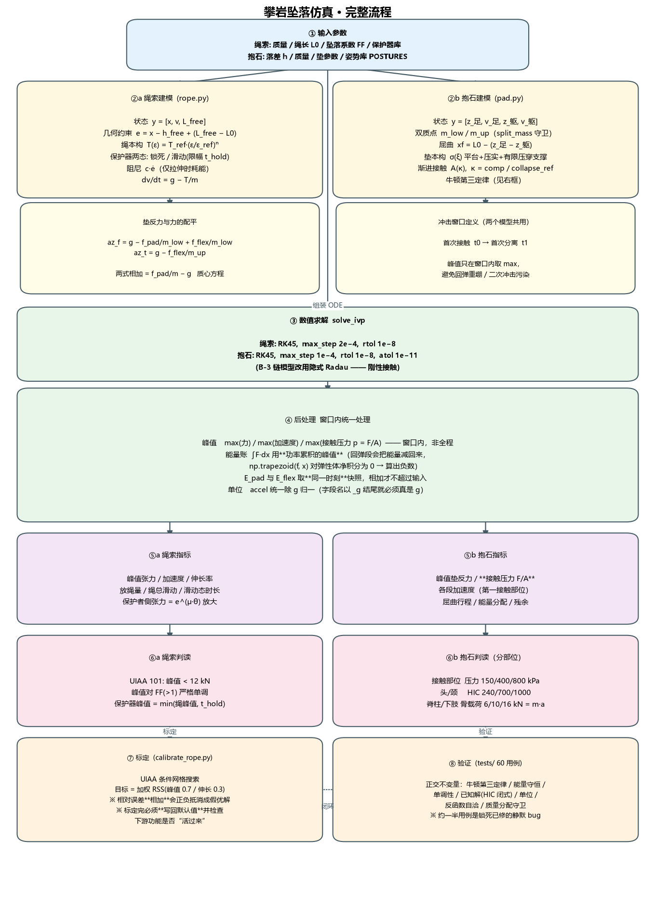

# 阶段性总结与经验记录

范围：Phase A（绳索）+ Phase B-1/B-2（抱石）+ Phase B-3（多刚体，结构完成未标定）
时间：2026-10-02 ~ 2026-10-03
提交：`694a2bd` / `700a186` / `6222aed`

> 本文第二、三节是重点。第一节是状态快照，可以略读。
>
> - 第二节后半（§2.3 流程图、§2.4 仿真方法、§2.5 掉落姿势建模）是**当前实现的权威说明**
> - 第三节是**经验记录**，重点是"怎么避免重蹈覆辙"
>
> 📐 **结构性局限与重构路线见 [`docs/方案更新_v2.md`](docs/方案更新_v2.md)**
> —— 本文记录的是"v1 做对了什么"，那份文档记录的是"v1 缺了什么"。

---

# 一、状态快照

| 模块 | 状态 | 主用？ |
|---|---|---|
| `climbing/rope.py` 绳索 | ✅ 已标定 | ✅ |
| `climbing/belay.py` 保护器 | ✅ 正常 | ✅ |
| `climbing/pad.py` 抱石（双质点） | ✅ 结论稳定 | ✅ **主用** |
| `climbing/injury.py` 分部位损伤 | ✅ 相对排序可用 | ✅ |
| `climbing/metrics.py` HIC | ✅ | ✅ |
| `climbing/bodies.py` 多刚体链（B-3） | ⚠️ 结构完成，参数未标定 | ❌ |
| `legacy/` 旧质点模型 | 已归档备查 | ❌ |

- 60 个回归测试全绿，约一半用于锁死已修的静默 bug
- 图表：`results/figures/` 8 张；报告：`results/*.txt`

---

# 二、结论

> ## ⚠️ 阅读本节前必读：结论的适用范围
>
> 以下结论全部在**【一维、竖向、纯压缩】**这个框架内成立。
> 框架本身有**结构性缺口**，由方案 v2 诊断出来 →
> [`docs/方案更新_v2.md`](docs/方案更新_v2.md)。
>
> | 结论 | v2 的修正 |
> |---|---|
> | "决定伤害的是接触面积和屈曲行程" | 仍成立，但只覆盖**压缩类**损伤 |
> | "软垫确实有用但不万能" | 仍成立；且**软垫的另一个作用（踝旋后）本模型算不出** |
> | 绝对损伤分档不可用 | 仍成立；v2 的 P0 已给出**分部位**替代方案 |
>
> **v2 指出的最大缺口**：模型**没有转动自由度**，而
> **踝关节扭伤是抱石摔伤的第一大类（26–28%，两个独立人群一致）**，
> 扭伤是转动 + 韧带损伤 —— **本模型结构上算不出来**。
> 所以下面这些结论**没有错，但不完整**。

## 2.1 抱石：决定伤害的是接触面积和屈曲行程，不是软垫

3.0 m / 80 kg / 20 cm 标准 PU 软垫：

| 姿势 | 峰值力 | 接触面积 | **峰值压力** | 接触部位 g | HIC |
|---|---|---|---|---|---|
| 平拍（背臀着垫） | 59.7 kN | 6000 cm² | **100 kPa** | 98 | **1100** |
| 前脚掌点地（垫偏） | 34.4 kN | 1300 cm² | **395 kPa** | 48 | 249 |
| 单脚先落（踝外翻） | 42.4 kN | 1494 cm² | **295 kPa** | 50 | 297 |
| 伸直腿滞后落地 | 47.2 kN | 2854 cm² | 172 kPa | 63 | 411 |
| 头朝下（失控） | 16.6 kN | 771 cm² | 215 kPa | 46 | 133 |
| 团身翻滚 | 28.5 kN | 1322 cm² | 216 kPa | **34** | 207 |
| 屈膝缓冲 | 30.2 kN | 1084 cm² | 278 kPa | 37 | 224 |

**三条机制**：

1. **接触面积小 → 压力主导。** 前脚掌落地力只有平拍的一半，**压力是 4 倍**。
   后果是跖骨骨折/踝扭伤。**只看"力"会把这些姿势排到安全那侧。**

2. **屈曲行程不足 → 脊柱/下肢惯性载荷主导。** 躯干动量只能靠止挡吃掉，
   轴向载荷 `m·a` 沿脊柱传下去（伸直腿 22.5 kN vs 团身 21.1 kN）。

3. **接触过早铺开 → 面积有了但行程被浪费。** 平拍一落就是 0.6 m²，压力最低
   （100 kPa），但屈曲行程只有 3.2 cm，HIC 反而全场最高（1100）。
   **吸能靠位移，不靠面积。**

**头朝下是陷阱**：峰值力全场最低（16.6 kN）看着最安全，但 6.4 kg 的头独自
扛下全部冲击。HIC 必须算在**第一接触部位**上。

**软垫确实有用但不万能**：峰值压力比硬地低 36–68%，垫厚从 10→40 cm 压力从
556→222 kPa，但**3 m 落差下没有一种姿势是零风险**。

## 2.2 绳索

UIAA 101（80 kg / FF=1.77 / L0=2 m）：

| | 模型 | 实测 |
|---|---|---|
| 峰值力 | 8.17 kN | 8–9 kN |
| 伸长率 | 28.8% | 30–40% |
| 12 kN 判据 | 通过 | 通过 |

参数：`t_ref=9000, eps_ref=0.30, exponent=2.40, c_damp=100`
峰值对 FF(>1) 严格单调；保护器峰值 = `min(绳峰值, t_hold)`。

---

# 二之二、当前仿真方法与流程

## 2.3 完整流程图



> 图由 `scripts/make_flowchart.py` 生成。若修改了建模流程，请同步重跑
> `python scripts/make_flowchart.py`。

## 2.4 方法要点

### 2.4.1 两条建模通道

**绳索通道**（`rope.py`）—— 3 状态 ODE：

| 符号 | 含义 |
|---|---|
| `x` | 坠落者自释放点起的向下位移 (m) |
| `v` | 向下速度 (m/s) |
| `L_free` | 保护器与坠落者之间的自由绳长 (m)，保护器滑动时增长 |

几何约束给出伸长量与应变：

```
h_free = max(0, FF − 1) · L0          FF ≤ 1 时绳在释放瞬间就绷紧，无自由落体段
e      = max(0, x − h_free + (L_free − L0))
ε      = e / L_free
```

绳本构是**硬化幂律**（低应变软、高应变急硬化）：

```
T(ε) = T_ref · (ε / ε_ref)^n        n = 2.40 (>1 硬化)
```

保护器**两态**：张力超过保持力 `t_hold` 即进入滑动态，坠落者只受限幅张力
`T = t_hold`，同时按 `L̇ = v / (1 + ε_hold)` 放绳。

阻尼只在**拉伸**时耗能（单向），`t_damp = c · ė`，`e > 0` 才生效。

```
dv/dt = g − (T + t_damp) / m
```

**抱石通道**（`pad.py`）—— 双质点串联，4 状态 ODE：

| 符号 | 含义 |
|---|---|
| `z_足`, `z_躯` | 足（第一接触点）与躯干 CoM 的向下位移，初值 `0` / `−0.85` |
| `m_low` / `m_up` | 第一接触段与其余质量，**必须都严格为正**（`split_mass` 守卫） |

屈曲行程 = 腿被压短的量：

```
x_f = L0 − (z_足 − z_躯)
```

软垫本构是**平台 + 压实 + 有限压穿支撑**三段：

```
σ(ξ) = σ_pl·(1 − e^(−ξ/ξ_pl))  +  σ_d·(ξ/ξ_d)^n  +  E_bot·max(ξ − ξ_d, 0)
ξ    = 压缩量 / 垫厚
F    = σ(ξ) · A(κ)              接触面积随时变 κ 展开
κ    = 压缩量 / collapse_ref
```

屈曲弹簧力 = 弹性 + 肌肉阻尼 + 行程用尽后的止挡，**只传内力**：

```
f_flex = k·x_f  (+ k_stop·(x_f − x_max))  +  c_flex·max(0, ẋ_f)
```

两条动力学方程必须满足牛顿第三定律——`f_flex` 是内力，一上一下配平：

```
az_足 = g − f_pad/m_low + f_flex/m_low
az_躯 = g − f_flex/m_up
```

> 两式相加 = `f_pad/m − g`，即质心方程。这是 `tests/` 里的一条硬断言。
> 早期版本写成 `az_足 = g − (f_pad + f_flex)/m_low`（屈曲力也算向上），
> 合外力变成 `f_pad + 2·f_flex`，系统凭空获得能量。

### 2.4.2 三个横跨两个模型的关键约定

这三条是本项目**最容易被静默破坏**的地方，各自都对应一次线上事故：

**① 冲击窗口。** 峰值只在「首次接触 → 首次分离」之间取 `max`，不对全程取。
绳索若取全程，会被回弹重绷污染（实测 FF=1.5 给 17.3 kN，**高于** FF=1.77 的
10.8 kN，物理上不可能）；抱石若取全程，会被第二次冲击盖掉首次峰值。

**② 能量账用功率累积的峰值。** 不能用 `np.trapezoid(F, x)`——回弹段 `x` 减小
会把能量又减回来，弹性体净积分为 0，代码里实际算出过 `e_pad = −0.098 J`。
正确做法是对功率 `F·ẋ` 做累积并取峰值，且 `E_pad` 与 `E_flex` 必须取
**同一时刻**的快照（各取各自峰值再相加会超过输入能量）。

**③ 单位统一。** `accel_*_g` 字段名以 `_g` 结尾就必须真的除过 `g`。
绳索侧一直是对的，抱石侧曾存 m/s²，两张表并排会差 9.8 倍。

### 2.4.3 求解与标定

| 环节 | 设置 |
|---|---|
| 求解器 | `scipy.integrate.solve_ivp`；绳索/抱石用显式 RK45，`max_step` 2e−4 / 1e−4，`rtol` 1e−8 |
| 刚性接触 | B-3 链模型改用隐式 **Radau**（显式下系统会凭空产生能量） |
| 标定 | `calibrate_rope.py` 在 UIAA 条件做网格搜索，目标 = **加权 RSS**（峰值 0.7 / 伸长 0.3） |
| 验证 | `tests/` 60 个用例，核心是 7 条**正交不变量**（见 §3.1） |

标定目标函数用 RSS 而非误差相加，是因为相加会让「峰值偏低」与「伸长偏高」
正负抵消，出现总误差 0.002 的假优解。权重 0.7/0.3 直接对应
「峰值力是安全关键量（12 kN 判据作用在它上面），低估冲击力更危险」的取舍。

### 2.4.4 伤害判据（`injury.py`）

分部位评估，因为**力小不代表不伤**：

| 部位 | 指标 | 分档 | 物理依据 |
|---|---|---|---|
| 第一接触部位 | 峰值接触压力 `p = F/A` | 150 / 400 / 800 kPa | 瞬态冲击下软组织挫伤/撕裂的量级 |
| 头/颈 | HIC = `max w·(avg\|a\|)^2.5` | 240 / 700 / 1000 | Maag 标准分档，15 ms 与 50 ms 窗口取最大 |
| 脊柱、下肢 | 轴向骨载荷 `F = m·a` | 6 / 10 / 16 kN | 活体椎体/胫骨轴向失效量级 8–16 kN |

三个要点：

1. **HIC 必须算在第一接触部位上。** 头朝下落地时 `m_low` 就是头（6.4 kg），
   一律取躯干（73.6 kg）会算出 HIC=83 显示「全场最安全」，排名完全反了。
2. **HIC 的被积量是合矢量模长**，必须取 `|a|`。早期直接对带符号的 `a` 取
   2.5 次幂，负数 → NaN → `if val > best` 对 NaN 恒 False → **静默返回 0**。
3. **脊柱/下肢用惯性载荷 `m·a`，不用弹簧力 `f_flex`。** 后者混着
   `c_flex·rate` 这个纯阻尼项（屈曲速率 8 m/s 时就有 32 kN），
   会把轴向载荷虚高到 44–48 kN，判读全部顶「极高」，分档失去区分度。

> ⚠️ 这三个分档目前**只能用于相对比较**。绝对阈值偏保守，3 m 落差下几乎
> 所有姿势都会顶「极高」。原因见 §3.8 与 README「已知局限」。

## 2.5 掉落姿势的建模

### 2.5.1 核心思路：姿势是**参数**，不是独立仿真

模型里**没有"姿势"这个对象**，也没有针对每种姿势的专门代码。所有姿势跑的是
**同一个 ODE**，区别只在初始化时读入的一组参数。

```
simulate_boulder_fall(posture="toe-point")   # 只换了一个字典键
```

这样做的收益：**加新姿势 = 加一条数据，不改任何代码。**

### 2.5.2 五个参数

| 参数 | 编码的是什么 | 物理含义 | 典型范围 |
|---|---|---|---|
| `m_low_frac` | 质量怎么分 | 哪个部位承担第一击 | 0.06（脚尖）～ 0.85（平拍） |
| `k_flex` | 腿硬不硬 | 屈曲刚度 | 8.0e4（头）～ 1.6e6（绷直腿） |
| `x_flex_max` | 能屈多少 | 可用屈曲行程 | 0.02（绷直）～ 0.40 m（深蹲） |
| `contact_schedule` | 接触面怎么展开 | `(κ, 面积)` 折线，**时变** | 0.018 ～ 0.70 m² |
| `collapse_ref_m` | 塌陷到哪算"到底" | 把 κ 归一成无量纲进度 | 0.16 ～ 0.52 m |
| `first_contact` / `first_contact_is_head` | HIC 算在谁头上 | 第一接触部位（见 §2.4.4） | — |

`m_low_frac` 的取值有**人体测量学约束**（80 kg 男性量级）：双腿合计约 18–19%、
头颈约 8%、骨盆+大腿约 50%、躯干约 43%。这不是调出来的，是查表来的。

### 2.5.3 参数在哪三处进入方程

`rhs()` 每一步只用到三个姿势参数：

**① 质量分配**（`split_mass`，一次性，在积分开始前）
```python
m_low = m * post.m_low_frac      # toe-point: 80 × 0.06 = 4.8 kg（前脚掌）
m_up  = m * (1 - post.m_low_frac) #            = 75.2 kg
```

**② 屈曲弹簧**（`flex_force`，每步）
```python
f = post.k_flex * x_f                                   # 刚度
if x_f > post.x_flex_max:
    f += k_stop * (x_f - post.x_flex_max)                # 行程用尽 → 撞止挡
```

**③ 垫接触**（`rhs` 内，每步）
```python
kappa = comp / post.collapse_ref_m        # 塌陷进度
area  = post.area_at(kappa)               # 按 contact_schedule 插值
f_pad = pad.force_n(comp, area)           # 面积随塌陷展开
```

**运动方程本身与姿势完全无关**：
```
az_足 = g − f_pad/m_low + f_flex/m_low
az_躯 = g − f_flex/m_up
```

### 2.5.4 完整姿势库（`pad.POSTURES`）

| 键 | 名称 | `m_low_frac` | `k_flex` | `x_flex_max` | 面积展开 (m²) | 第一接触 |
|---|---|---|---|---|---|---|
| `flat-flop` | 平拍 | 0.85 | 4.0e5 | 0.02 | 0.30 → 0.70 | 背/臀 |
| `butt-impact` | 坐落 | 0.50 | 1.2e5 | 0.08 | 0.14 → 0.42 | 臀/骶 |
| `feet-first-stiff` | 脚先落腿绷直 | 0.18 | 1.1e6 | 0.03 | 0.045 → 0.30 | 双足外缘 |
| `controlled-drop` | 屈膝缓冲 | 0.18 | 2.2e5 | **0.40** | 0.050 → 0.58 | 双足全掌 |
| `tuck-roll` | 团身翻滚 | 0.20 | 1.6e5 | 0.30 | 0.055 → 0.60 | 双足 |
| `head-first` | 头朝下 | 0.08 | 8.0e4 | 0.25 | 0.055 → 0.10 | 头顶\* |
| `toe-point` | 前脚掌点地 | **0.06** | 9.0e5 | 0.02 | **0.018** → 0.13 | 跖骨前缘 |
| `shoulder-first` | 肩先着垫 | 0.16 | 3.0e5 | 0.10 | 0.075 → 0.34 | 单侧肩 |
| `one-leg-awkward` | 单脚先落 | 0.10 | **1.3e6** | 0.025 | 0.030 → 0.18 | 单足外缘 |
| `superman-late` | 伸直腿滞后 | 0.20 | **1.6e6** | 0.02 | 0.060 → 0.52 | 双足弓 |

\* `head-first` 设了 `first_contact_is_head=True`，HIC 取头部（= `m_low`）而非躯干。

**读表要点**：`toe-point` 与 `flat-flop` 的对比最能说明问题——面积起点差 **17 倍**
（0.018 vs 0.30），所以前脚掌的**力**只有平拍一半，**压力**却是 4 倍。

### 2.5.5 为什么 `contact_schedule` 必须时变

这是本模型与旧质点模型（`legacy/`）最本质的区别。

前脚掌点地时接触面积随塌陷逐步展开：

| κ（塌陷进度） | 0.0 | 0.2 | 0.6 | 1.0 |
|---|---|---|---|---|
| 面积 (m²) | 0.018 | 0.030 | 0.075 | 0.13 |

而平拍**一触地就是 0.30 m²**，直接铺满。

若用恒定面积（旧模型的做法）：

- 前脚掌的"力集中在小面积上"**根本画不出来** —— 压力永远等于力除以常数
- 而**压力**才是跖骨骨折/踝扭伤的判据
- 结论会退化成"力小就安全"，把前脚掌点地排到安全那侧

这条时变曲线是 §2.1 里三条机制（压力主导 / 行程不足 / 接触过早铺开）能够
被区分开的**唯一载体**。

### 2.5.6 B-3 链模型里的姿势是另一套词汇

`bodies.py` 的 `ChainPosture` 用链的语汇重新编码，节点定义为
**足(0) − 踝 − 膝 − 髋(3) − 肩(4) − 头(5)**：

```python
"controlled-drop": ChainPosture(
    base="controlled-drop",                    # ← 与 B-2 同名，可直接对比
    contact_nodes=(0, 3, 4),                   # 哪些节点能碰垫面
    preflex_m=(0.01, 0.06, 0.06, 0.01, 0.0),   # 5 个关节的初始预屈曲
    scale_f_iso=1.0,                           # 肌肉激活系数
    contact_area_m2={0: 0.050, 3: 0.30, 4: 0.26},
)
```

| 维度 | B-2（双质点） | B-3（六节点链） |
|---|---|---|
| 姿势参数 | 5 个标量/折线 | 节点子集 + 5 个关节预屈曲 + 肌肉激活系数 |
| 接触如何展开 | `contact_schedule` 显式给面积曲线 | 由 `contact_nodes` 顺序 + 各节点面积**涌现** |
| 质量分配 | 人为给 `m_low_frac` | 由解剖学常数决定（`SEGMENT_MASS_FRAC`） |
| 对应关系 | — | `base` 字段一对一映射到 B-2 |

B-3 的表达力更强（接触时序是**涌现**的，不用手工编面积曲线），
但**参数未标定，数值不可用**（§3.6）。

### 2.5.7 坑：`preflex_m` 是改几何，不是加预压

`preflex_m` 最初的实现是"给关节弹簧预压储能"。后果：t=0 时 1.18 kg 的足节点
拿到 **3043 m/s²** —— 身体在释放瞬间被自己的腿弹开。

**正确做法是改初始几何**：蹲姿 = 静止长度更短，而不是弹簧里多了能量。

```python
L_rest[i] = L[i] - preflex_m[i]     # 蹲姿 → 静止长度更短
x = L_rest - gap                    # 相对该姿态的参考构型算压缩 → t=0 时 x=0
```

这个 bug 的症状（t=0 巨大加速度）和 §3.2 的布局类 bug 一样，**不报错**，
只是让整个时程从第一帧就是错的。

### 2.5.8 加一个新姿势的标准流程

1. 查人体测量学表，确定该姿势的**第一接触部位**和**质量占比** → `m_low_frac`
2. 确定第一接触部位的面积，以及随塌陷如何展开 → `contact_schedule`
3. 确定关节能屈多少（绷直 / 深蹲 / 来不及）→ `k_flex`, `x_flex_max`
4. 落点是否需要**整个垫面被压穿** → `collapse_ref_m`
5. 若是头颈，加 `first_contact_is_head=True`
6. 往 `POSTURES` 加一条，**不需要改任何代码**
7. 跑一遍，检查 §3.1 的 7 条不变量是否仍然成立
8. 加一个回归测试锁住这个姿势的关键量

> ⚠️ **v2 修正**：这套流程有一个隐含前提 —— **姿势的参数空间覆盖了真实场景**。
> 但按 [B25] 的实测频次，**脚先落地占 87%**，我们的 10 种姿势权重是**猜的**；
> 且真实场景还有**旋转（62%）**和**倾斜（43%）**两个维度，
> 本框架的 5 个参数**表达不了**。见 `docs/方案更新_v2.md` L5/L7/L11。

## 2.6 姿势库的数据化（v2 · P1 预告）

[B25] 给出了可直接使用的**真实频次**，这是替换"猜的权重"的依据：

| 维度 | 取值与权重 |
|---|---|
| 墙型 | 垂直 .45 / 倾斜 .29 / slab .12 / 屋檐 .07 / 角 .05 |
| 高度 | 墙顶 .47 / 墙中 .31 / 墙底 .20 |
| 起始姿势 | 竖直 .62 / 后仰 .19 / 前倾 .08 |
| 旋转 | 纵向 .36 / 前后向 .09 / 后横 .04 / 前横 .03 / 多重 .08 / **无 .39** |
| 落地姿势 | 脚站 .44 / **脚+倾斜 .43** / 头先 .10 / 背 .01 / 臀 .02 |

另有诱因分布：脚滑 29% / dyno 22% / 抓空 21% / 路线收尾 6% / 失衡 4%。

**产出目标**（V5）：用真实权重跑蒙特卡洛，输出的**损伤部位分布**应与
实测吻合 —— 下肢 ~67%（[B25]）/ ~61%（[H24]）、**踝为第一大部位**、头颈 ~3%。

---

# 三、经验

## 3.1 【最重要】物理模型的 bug 不会自己暴露

这一轮修的 20 多个 bug 里，**没有一个会报错**。它们全部满足：不抛异常、
输出格式正常、数值量级看着合理、图表能画出来。特征是**结果符合直觉就放过了**。

典型对照：

| 错的地方 | 输出看着像 | 实际是 |
|---|---|---|
| `HIC` 对带符号加速度取 2.5 次幂 | 0.0 | 负数→NaN→`if val>best` 恒 False，**永远返回 0** |
| `m_low_frac=1.00` | 峰值力 88 kN，"正常" | 躯干方程除以 1e-6，**2 s 自由落体 20 m** |
| 躯干初值符号反 | 能画出图 | 躯干被放到脚**下方** 0.85 m，埋在垫里 |
| 违反牛顿第三定律 | 能跑完 | 系统凭空获得能量 |
| 能量账 `np.trapezoid(f, x)` | `absorbed=-0.0%` | 弹性体净积分为 0，**算出负数** |
| 峰值取全程 max | 曲线有峰 | 被**第二次回弹**污染，FF 非单调 |
| `hard_surface` 走饱和指数 | 名字叫"硬地面" | 比软垫还软，**安全排序颠倒** |
| HIC 一律取躯干 | 头朝下 HIC=83，"最安全" | 排名**完全反了** |

**结论**：物理模型必须靠**正交不变量**把关，不能靠"跑通了"。

### 本项目实际用到的正交不变量

写进 `tests/` 的就是这些，每一条都对应一次静默失效：

1. **牛顿第三定律**：质心加速度必须满足 `m·a_com = f_pad − m·g`
2. **能量守恒**：吸收能量必须为正、且不超过输入
3. **单调性**：峰值力对 FF 单调；应力对应变单调；分档连续不留空隙
4. **已知解**：恒定加速度下 HIC = `w·a^2.5`（闭式解）
5. **单位一致性**：`accel_*_g` 真的要是 g
6. **反函数自洽**：`tension(eps_at_tension(T)) == T`
7. **质量分配守卫**：`m_low, m_up > 0` 硬性拦截

**建议**：任何物理模型项目，第一批测试就应该是这些不变量，
而不是先跑场景。先跑场景等于让 bug 藏在数据里。

## 3.2 布局类 bug 的通用模式

这一轮最耗时的 bug 几乎全是**数组布局/轴向**问题，模式高度重复：

| 模式 | 症状 | 修法 |
|---|---|---|
| rhs 返回**分块** `[v, a]`，y0 是**交错** `[z0,v0,...]` | 第一步后状态错位，第 ~440 步炸 | 布局必须双向对齐，加断言 |
| `Y[0::2]` 是**节点优先** `(6, T)`，却写 `z[:, nd]` | 切到时间轴，返回长度 6 的数组 | 提取后立刻 `.T` 统一成时间优先 |
| 同一函数要同时处理 1-D 状态和 2-D 稠密输出 | 广播维度不匹配 | 显式 reshape |

**教训**：涉及 `(node, time)` / `(time, node)` 时，在提取点加一行注释说明朝向，
比事后 debug 便宜一个数量级。

## 3.3 诊断工具本身也要验证

**两次差点被自己的诊断脚本带偏**：

1. 诊断脚本的"精确解"参照式符号写反（z 向下为正，掉落应该 z **增大**），
   把一次**正常的垫面回弹**误判成"积分发散"，白查一轮。
2. 诊断脚本用 `np.concatenate([z0, zeros])` 造 y0（分块），而模型用交错布局，
   于是"复现"出一个根本不存在的 bug。

**教训**：
- 诊断脚本对**已知可解析的情形**要先自检（自由落体应当精确匹配）
- 怀疑模型之前，先用诊断脚本验证**诊断脚本本身**

## 3.4 调试纪律：先隔离，再修

三个诊断动作按顺序做，每一步都真的缩小了范围：

1. **缩小参数空间** —— 0.05 m 落差（接触前）也失败 ⇒ 问题不在接触
2. **关闭可疑项** —— 去掉肌肉、换极软垫仍失败 ⇒ 不是软垫也不是肌肉
3. **直接调 rhs** —— 手写 RK4 步进对比精确解 ⇒ 定位到布局/状态问题

反过来，如果一开始就去调 `max_step`/`rtol`，会浪费大量时间在一个
根本没坏的地方。

## 3.5 修 bug vs 调标定，必须分清

这轮至少有三次，代码**已经正确**，但输出不合理。诱惑是去调参数让它"看起来对"。
**停下来的判断依据**：

| 情形 | 是 bug 还是标定？ | 处理 |
|---|---|---|
| `hard_surface` 用饱和指数表达 k·x | **bug**（与自身 docstring 矛盾） | 修 |
| 泡沫本构 60% 应变就进刚性壁 | **标定**（与文献量级矛盾，有据可依） | 重标 + 写明依据 |
| `c_flex=3e3` 虚高，单独贡献峰值力大半 | **标定** | 降到 400 并写明真实量级 |
| B-3 链模型挡不住 80 kg | **物理问题**（见 3.6） | 停，不调参 |

**判据**：有文献/物理依据可对照 ⇒ 标定，据实重标并记录来源；
无依据、只是"结果不好看" ⇒ **不要调参**，先查清是不是模型表达不了这个物理。

尤其：**当参数的物理量级已经不合理时，为了让结果好看去调它，是在制造假象。**

## 3.6 什么时候该停：B-3 的教训

B-3 目标是修掉 B-2 的两个结构性问题（躯干屈曲行程被低估、绝对损伤判读全顶"极高"）。
结构工作全部做完，但验收判据**两条都失败**：

- 屈曲行程 0.068 m（要求 0.20–0.50 m）
- 躯干加速度 68.6 g，**高于** B-2 的 37.2 g

继续做了一件关键的事：**判断是参数问题还是模型问题**。

- 把肌肉等长力 `f_iso` 放大 **12 倍**，结果几乎不变（终态动能 560→523 J，
  屈曲 6.8→3.8 cm）⇒ 瓶颈**不在**肌肉参数
- 算了一下需要的力：阻止 80 kg 从 7.67 m/s 停下需约 **28 kN**；
  当前垫峰值 3 kN + 膝 2.5 kN ≈ 7 g，**差约 10 倍**
- 根因是**接触时序**：足节点只有 1.2 kg，撞垫后约 10 ms 就弹回，
  其余 79 kg 还没接上，链条被抗拉止挡拉回去弹跳

**这不是调参能解决的**，需要渐进接触或真正的多刚体接触求解（MuJoCo）。
所以停下，把 B-2 留作主用模型，B-3 留作下阶段起点。

**如果当时继续调 `f_iso` / `k_elast`，很可能把"能量守恒但物理错误"的状态
调成"看起来合理"，那比明确的失败更糟。**

## 3.7 标定必须闭环

旧版 `RopeModel` 默认值是 `(8000, 1.40, c=250)`，标定脚本跑出了最优值，
但**从没写回默认值**。后果：

- 模型峰值只有 5.58 kN，比实测低 30%
- 因为够不到任何保护器的 `t_hold`，保护器对比表里
  **ATC / Reverso / 8字结 四行输出完全相同** —— 一张毫无信息量的表

**标定跑完不写回 = 没标定。** 而且要检查标定结果是否让下游功能"活过来"
（这里的信号就是"各设备结果开始分化"）。

顺带：标定的目标函数也踩过坑 —— 用**相对误差相加**时，
"峰值偏低 13%"和"伸长偏高 13%"会互相抵消成总误差 0.002，出现假优解。
改用加权 RSS（峰值 0.7 / 伸长 0.3），权重直接对应"峰值是安全关键量"的取舍。

## 3.8 要说清"哪个结论能用"

不是所有输出都同等可靠。README 里明确分开写：

| 可信度 | 内容 |
|---|---|
| ✅ 可用 | 姿势间**相对排序**、受伤部位、机制解释、压力 vs 力的对比 |
| ❌ 不可用 | 绝对损伤分档（"3 m = 极高"、"0.2 m 就开始受伤"） |

如果不分开说，读者会把"3 m 判极高"当成结论，而它其实只是阈值偏保守 + 模型
高估躯干加速度的叠加产物。

同理，绳索那边：**幂律本构无法同时拟合峰值力和伸长率**（真实动态绳有"趾部"，
幂律从零点就硬化，画不出那个拐点）。取舍是优先保峰值力，代价是 `exponent=2.40`
高于文献的 1.3–1.7。这个取舍和它的理由都写进了 `RopeModel` 的 docstring。

## 3.9 回归测试是最便宜的保险

`tests/test_climbing.py` 60 个用例，约一半的 docstring 直接写着
"回归：XXX 曾经如何如何"。这些 bug 每一个都花了 20–60 分钟定位。

**一次性投入，换永久防护。** 以后每次改模型，先跑测试。

新增 bug 时的标准动作：**先写一个能复现该 bug 的失败测试，再修**。
这次的 6 个 B-3 实现 bug 都是这么锁住的。

## 3.10 归档优于删除

旧的质点模型（`run_phase_b1.py` 等）本来该删。用户要求保留并加说明，于是
`legacy/README.md` 里写清了三件事：

1. 旧模型漏掉了什么（三个机制）
2. 哪些结论**仍然成立**（"厚垫降峰值"成立，且新模型也证明）
3. 哪些数值**不可用**（全部绝对值）

这样它就从"混淆视听的旧代码"变成"记录思路演进的资料"。
归档的成本是 20 分钟，收益是以后任何人都能知道**为什么**要改成现在这样。

## 3.11 参数化优于分支化

落地姿势的建模方式经历了一次关键选择：**10 种姿势写 10 个模型，还是写 1 个模型
+ 10 组参数？**

选了后者。回头看这个决定的价值：

| | 分支化（10 个模型） | 参数化（1 个 ODE + 10 组参数） |
|---|---|---|
| 加姿势 | 复制粘贴一个模型 | 加一条数据 |
| 修 bug | 要修 10 遍，漏一处就产生假差异 | 修 1 遍，所有姿势同时受益 |
| 可比较性 | 姿势差异混着代码差异 | 差异**纯粹**来自参数 |
| 可验证性 | 10 套不变量测试 | 1 套不变量覆盖全部 |

**最有价值的一点是"可比较性"**：这一轮所有结论（前脚掌压力是平拍 4 倍、
团身翻滚 HIC 最低、头朝下力最低但最危险）都是**姿势之间的差异**。如果有 10 份
代码，任何一个复制粘贴时的疏漏都会变成"差异"的一部分，而**这种 bug 恰好属于
§3.1 那类不报错的静默 bug**——两个模型都能跑，输出看着都合理，结论却是假的。

**判据**：当你要为 N 个变体写 N 份几乎相同的代码时，先问能不能把它们
**投影到一组参数上**。物理建模里这个投影通常是存在的（质量、几何、本构、
边界条件），而且投影本身就会暴露"哪些因素真的在起作用"——`contact_schedule`
这个时变面积曲线就是在做投影时才被识别出来的关键自由度。

反过来也要警惕**过度参数化**：`legacy/` 的旧模型只有一个恒定面积参数，
看起来"参数化了"，但那个参数空间**表达不了**"压力主导"这个机制。
参数化的目的不是少写代码，是**让物理差异有地方可放**。

## 3.12 对标文献会逼出"只在极端参数下才暴露"的静默失效

方案 v2 的 P0 做了一件事：把骨骼阈值改成对标文献（[Y25]）的分部位形式，
然后**扫描 1–40 m 全高度**去对表。

结果在对表过程中撞出一个 v1 从未暴露的 bug：

> `t_max` 默认固定 **2.0 s**，而 20 m 自由落体需要 **2.019 s**。
> 于是 **h ≥ 19.6 m 时积分在撞击发生之前就结束**，
> 模型静默返回 `peak_force = 0 kN` —— 不报错、字段齐全、
> 数值看起来是"越高的坠落越安全"。

**为什么 v1 没发现**：v1 的所有场景高度 ≤ 3 m，永远碰不到这个边界。
缺陷一直存在，只是**参数空间没走到**。

**教训**：
1. **对标文献的价值不只是校准数值**，它会要求你在**更宽的参数范围**上
   产生结果，从而把只在边界暴露的失效逼出来。
2. 修的时候按 §3.9 的纪律做：换成自适应 `max(2.0, √(2h/g) + 1.0)`，
   **再加一道守卫** —— 全程未接触且 `h > 0` 直接抛 `RuntimeError`。
   只改默认值不够，必须让"没发生撞击"这件事**不可能静默通过**。
3. 补了 9 个回归测试。其中 5 个不是测这个 bug，而是测**新模块的物理不变量**
   （两端必须弱于骨干、单位换算自洽、利用率必须随高度单调）——
   新代码同样需要不变量，不能只靠"跑通了"。

## 3.13 "材料强度"和"整体结构强度"是两回事

P0 里最有价值的一条物理认识。

把文献的**材料强度**（MPa）× **承载截面**（mm²）换算成**整体骨失效载荷**（N），
听起来天经地义（`1 MPa = 1 N/mm²`）。实测对标结果：

| 组 | 部位 | 载荷路径 | 结果 |
|---|---|---|---|
| A | 胫骨远端、胫骨骨干、股骨颈 | 接近均匀柱体压缩 | ✅ 全部命中 |
| B | 跟骨、骨盆、腰椎 | 非均匀 / 整体结构 | ❌ 系统性偏晚，跟骨高估 17–34× |

**根因**：材料强度描述的是**组织**，不是**结构**。

- 跟骨 —— 荷载经足弓与距下关节非均布，以小梁骨为主
- 骨盆 —— 环状结构，靠**环的完整性**而非截面承压
- 腰椎 —— 小梁骨 + 终板 + 椎间盘共同作用

**教训**：
1. 换算前先问一句：**这个构件是"均匀柱体"吗？** 是 → 材料强度可用；
   不是 → 必须用整体结构的失效数据。
2. **不能用单一折减系数统一修正** —— 组 A 不需要折减，组 B 需要 6–34×。
   如果图省事乘一个 0.1，会把已经准确的组 A 弄坏。
3. 这类整体数据是**存在的**：跟骨就有经验证的接触力-骨折概率曲线
   （Voo HIPC，Barnes 等 IRCOBI 2019 用全身 PMHS 验证）。
   **缺的不是数据，是去找**。

**顺带一个同类的坑**（一半是自嘲）：我在诊断函数里硬编码了"高估约 6–13 倍"，
而实际算出的是 **17–34×**——**硬编码了一个本该派生的数字**，
正是 §3.1 反复出现的那类错误。已改成运行时计算。

## 3.14 测试抓出的错误：别把"总力"喂给"单根构件"

P0 实现时我把 `f_flex`（**双腿合计**的轴向力）**同时**喂给胫骨和腓骨，
各拿它去比自己的阈值。回归测试立刻报错：

> `1.0 m 落软垫` → 判腓骨两端骨折 **2.25×**

物理上荒谬（1 m 落软垫不可能断腓骨），根因是**没有做载荷分配**：

- 完整小腿中，轴向载荷主要由**胫骨**承担，**腓骨只分担约 10%**
- 所以单侧胫骨 ≈ 通路的 45%，单侧腓骨 ≈ 5%

加了 `load_fraction` 之后，同一场景的利用率从 2.25 降到 0.11。

**教训**：凡是"一个总力分配给多个并联构件"的地方，都要显式写下分配比例。
**比例写错 = 静默高估**，而它只会体现在某些参数点上（这个例子正是 1 m 这种
低位场景），不写测试根本看不出来。

---

# 四、下一步

> ⚠️ **本节已由 v2 重排。** 下列内容仍在 v1 框架内（B-3 / 绳索 / 标定欠账）。
> **整体优先级路线见 [`docs/方案更新_v2.md`](docs/方案更新_v2.md) §七**，
> 那里把"补上转动自由度"提到了 B-3 之前 —— 因为
> **一只算不出扭伤的模型，把 B-3 的接触时序修好也仍然答不上最主要的问题**。
>
> v2 路线：`P0 ✅ → P1 场景权重 → V1/V2 对表 → P3 二维运动学 → P2 踝转动+滑动 → P4`

## 4.1 阻塞项：B-3 的接触时序

要让链模型能站住，需要的是**渐进接触**——质量随塌陷逐渐接入，
而不是足节点先独自撞上去。可选路径：

1. 按人体测量学重新分配足/踝段的质量与接触面积
2. 给链加入**接触面随塌陷展开**的机制（B-2 里已证明有效的那部分）
3. 真正做多刚体接触（MuJoCo），彻底解决

在此之前 **`pad.py` 仍是主用模型**。

## 4.2 标定欠账

- **硬地面刚度**（当前 1.0e7 N/m）：全模型标定最弱的一环，
  只是文献量级推断，`tests/` 里只有定性断言，需要对标实测跌落数据
- **泡沫本构**：已对上开放孔 PU 量级，但不是本项目实测标定
- **绳索趾部本构**（Phase A-2）：换分段本构，修掉峰值力/伸长率不可兼得

## 4.3 已知方法论缺陷

- **加速度随质量反向**（50 kg: 57 g → 120 kg: 37 g）。线性弹簧标度的
  必然结果（`a ∝ √(k/m)`）。方向上与"儿童比成人摔得重"的临床观察一致，
  但幅度是模型产物，**不可外推**。真实组织刚度随质量标度 ~m^0.67。
- **接触段数值振荡** ~30 Hz（刚性接触 + 显式 RK45），峰值可用、波形细节不可信。

## 4.4 本轮新增的经验小结（v2 会话）

| # | 经验 | 详见 |
|---|---|---|
| §3.12 | 对标文献会逼出"只在极端参数下才暴露"的静默失效 | `阶段总结.md` §3.12 |
| §3.13 | "材料强度"和"整体结构强度"是两回事 | §3.13 |
| §3.14 | 别把"总力"喂给"单根构件"（载荷分配） | §3.14 |
| — | 两个独立数据源收敛 → 排除单研究偏倚 | `.learnings/LEARNINGS.md` LRN-004 |
| — | 一个模型能算的量和它该回答的问题可能根本不匹配 | LRN-006 |
| — | 反直觉结论要当不变量用，不当噪声 | LRN-007 |
| — | **引用文献数字前先确认是"全体"还是"子群体"** | LRN-008 |
| — | **放宽求解精度换速度，必须同时交一条等价性测试** | LRN-009 |

## 4.5 P1 已完成（场景库数据驱动）

**实现**：`src/climbing/scenarios.py` + `scripts/phase_p1_montecarlo.py`
（N=1000，seed=20261003）→ `results/p1_montecarlo.{txt,csv}` +
`results/figures/p1_coverage.png`；测试 69 → **97** 全绿。

**结论（三条，全部被数字支撑）**：

1. ✅ **采样器通过验证** —— MC 频率与 [B25] Table 3 的 95% CI 全部一致。
2. ❌ **模型在真实抱石场景下一例骨折都报不出来**（1000 次，最高利用率 0.725）。
   ⇒ 模型输出的损伤部位分布**是空的**，[B25] 的对表判据**无从建立** ——
   不是比例不对，是**没有东西可比**。
   （利用率随高度单调：0.199 → 0.360 → 0.497 ✅ 模型本身趋势正确。）
3. ✅ **一个重要的排除项**：最危险部位 **93.7% 是胫骨远端** ——
   那是 P0 对标 [Y25] **命中**的组 A。所以"零骨折"不是被
   组 B 那些不可靠阈值（跟骨高估 17–34×）掩盖出来的。

**覆盖度**：`全部坠落 100% → 无旋转可表达 32.6% → 结论可信 13.8%
→ 能产出的损伤类型 19.3%`

**这改变了 §四 的优先级**：P3 从"支撑 P2 的前置"升格为
**V5 能否满足的必要条件**；并新增 **P5（抱石专用标定）** ——
模型在真实抱石量程下只有 0.72 利用率，说明绝对阈值偏高或垫子偏软，
而这个缺口**文献里没有现成数据可修**。详见 `docs/方案更新_v2.md` §七。

---

**最后更新**：2026-10-03
**版本**：v1 结论 + v2 适用范围修正
**配套**：[`docs/方案更新_v2.md`](docs/方案更新_v2.md)（结构性诊断与重构路线）·
[`.learnings/`](.learnings/)（经验与错误清单）
**整理者**：Spark ⚡
